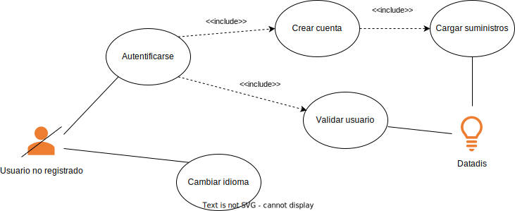
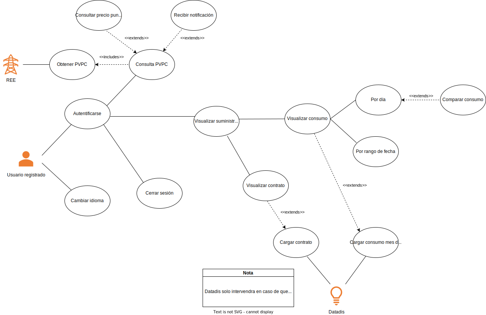

# Aplicación móvil para la visualización del consumo eléctrico de los clientes
  

**Índice**   
1. [Introducción al contexto del proyecto](#id1)
2. [Stack tecnológico](#id2)
3. [Metodologías empleadas](#id3)
4. [Diagramas de caso de uso](#id4)
5. [Manual de Uso](#id5)
6. [Conclusiones finales](#id6)

## Introducción al contexto del proyecto 
### Descripción/motivación del proyecto
Con este proyecto final de carrera se pretende ofrecer de cara al usuario medio una plataforma para dispositivos móviles que, de manera intuitiva y amigable, permita visualizar los suministros a su nombre (independientemente de la distribuidora que los gestione) y permitir para cada uno de ellos, acceder al detalle del contrato y poder visualizar los consumos en diferentes periodos.

Esto será posible gracias a las posibilidades de acceso a la información que proporcionan el despliegue de contadores inteligentes llevado a cabo por las empresas de distribución eléctrica, las cuales ofrecen un amplio abanico de posibilidades a los clientes. [Datadis](https://www.datadis.es) es la plataforma de datos de consumo que proporciona la **Asociación de Empresas Eléctricas (ASEME)**, la cual dispone de una API privada de la cual se obtendrá la información de los suministros.

Finalmente, en cuanto a las tecnologías que se han utilizado a lo largo de la implementación de este trabajo han sido Dart, un lenguaje de programación gratuito y abierto a la comunidad, empleando para ello del “framework” de Flutter y en cuanto al lado del servidor se ha utilizado el gestor de base de datos de SQLite.

### Objetivos
- Facilitar a los usuarios finales el acceso a la información detallada sobre los consumos de sus suministros eléctricos, lo que les permitiría tomar medidas para reducir su consumo y, por tanto, un posible ahorro en su factura eléctrica.
- Proporcionar una plataforma de visualización de datos atractiva e intuitiva global que permita a los usuarios entender mejor su consumo eléctrico y su contrato con la distribuidora eléctrica.
- Ayudar a las empresas de distribución eléctrica a mejorar la gestión de la energía, proporcionándoles información detallada sobre el consumo eléctrico de sus usuarios.
- Contribuir a la mejora de la eficiencia energética y la sostenibilidad, fomentando la reducción del consumo eléctrico y, por tanto, la disminución de emisiones de 𝐶𝑂2.
Servir como herramienta de educación y concienciación sobre la importancia de la gestión del consumo eléctrico y su impacto en el medio ambiente.

## Stack Tecnológico 
- Flutter
- SQLite

## Metodologías empleadas 
- SCRUM
- Kanban

## Diagramas de caso de uso 
### Casos de uso: usuario no registrado

### Casos de uso: usuario registrado

# Manual de Uso 
## Requisitos previos
- [ ] Dispositivo fisico o real donde ejecutar la aplicación.
- [ ] Registro previo del usuario en la plataforma de [Datadis](https://www.datadis.es).
   - [ ] Diponer de algún suministro a su nombre o ser autorizado.
- [ ] Acceso a Internet para disponer de conexión a las distintas APIs.

### Registro en la apliación
Tras el registro en la plataforma de Datadis, se debe abrir la aplicación y la primera pantalla que se mostrará será la de autenticación del usuario. En caso de no estar registrado pulsando el botón de Registro y rellenando el formulario superior previamente podremos registrarnos en el sistema rellenando el siguiente formulario, con nuestros datos y los datos de acceso a Datadis.

Tras completar los datos, se pulsará en el botón de Registrarse. Si todo ha ido bien, será redirigido a la página principal de la aplicación, en caso contrario, se mostrará un mensaje de error.

 

### Iniciar sesión
Para iniciar sesión, deberá pulsar en el botón de Iniciar Sesión que se encuentra en la pantalla rellenando previamente los datos de acceso. Al igual que en el registro, si el proceso se completa exitosamente, se redirigirá a la página inicial o se mostrará un mensaje de error en la parte inferior.

 

### Página de Inicio: Visualizar precio PVPC diario
Una vez se haya cargado la página principal, en esta podemos desde cambiar el idioma de la aplicación, consultar el precio de mercado regulado en el día de hoy en cualquiera de sus tramos y además visualizar directamente los puntos más críticos, es decir, aquellos en los que el precio es mayor y menor en el día. Además, haciendo clic en alguno de los puntos de la gráfica se mostrará debajo el precio para dicha hora en €/kWh.

Por otro lado, en la barra inferior, tenemos el menú de navegación que nos permite navegar entre las distintas vistas principales: Inicio, Suministros y Perfil.

### Cambiar idioma
Además durante el flujo continuo de la aplicación podrá cambiar el idioma entre las 3 opciones seleccionadas (Español, Inglés o Alemán).

### Ver suministros
Para consultar los suministros a su nombre o que haya sido autorizado podrá dirigirse al apartado correspondiente, donde visualizara una lista conformada por distintos suministros con los que puede interactuar.

A través de esta lista, podrá acceder a las funcionalidades de visualizar el contrato de un suminsitro o consultar el consumo del mismo.

### Ver contrato
Para consultar el contrato de un suministro navegaremos a la página de suministros, donde se desplegará una lista de los suministros asignados a nuestro usuario, si hacemos clic en el botón pertinente se nos mostrará una vista con toda la información relativa obtenida acerca del suministro.

### Ver consumo
Para consultar el consumo de un suministro navegaremos a la página de suministros, donde se desplegará una lista de los suministros asignados a nuestro usuario, si hacemos clic en el botón pertinente se nos mostrará una vista con un calendario donde podremos seleccionar el día o días a consultar.

Una vez hagamos esto en función del tipo de rango seleccionado se nos mostrará una u otra información. En caso de la primera se mostrarán 24 barras, una para cada hora del día con sus consumos en kWh respectivamente. En el caso de haber seleccionado más de un día, se mostrará n-barras verticales, una para cada día representando el consumo total de dicho día.

-- PENDIENTE IMAGEN ACTUALIZADA --

### Comparar un suministro
Cuando consultamos el consumo de un suministro para un día, tendremos la opción de comparar los resultados obtenidos con los del resto de suministros de los que se disponga datos a través de la base de datos.

Para ello disponemos en la parte inferior de un selector de provincia el cual será de obligatorio cumplimiento a la hora de realizar la consulta, y tras seleccionar el mismo, se mostrará en el siguiente seleccionable de carácter voluntario un desplegable de municipios para los cuales también se dispone de datos a comparar.

-- PENDIENTE IMAGEN ACTUALIZADA --

### Ver perfil
A través de su Perfil puede visualizar la información relativa a su usuario, además de disponer de un botón para cerrar su sesión.

## Conclusiones finales 
Introduciendo esta innovadora plataforma móvil, tendrás acceso a la consulta de suministros eléctricos de manera rápida y sencilla, sin importar el proveedor de servicios. Está aplicación móvil, compatible con cualquier dispositivo, ha sido desarrollada para permitir a los usuarios realizar todas las tareas mencionadas en las secciones anteriores.

Pero eso no es todo. 

Este proyecto ha sido una oportunidad de crecimiento personal, adquiriendo conocimientos en el desarrollo móvil con un lenguaje de programación de vanguardia, con una gran demanda en el mercado. Además, ha logrado fortalecer mis habilidades adquiridas a lo largo de la carrera.

En resumen, los objetivos planteados inicialmente han sido cumplidos con éxito, incluso se han agregado nuevas funcionalidades durante el desarrollo para brindar un mayor valor al producto. Y, para futuros proyectos, podríamos seguir mejorando y añadiendo características que brinden aún más utilidad y valor. Incluso considerar la posibilidad de ofrecer esta aplicación de forma gratuita para el público en general una vez se produjera su lanzamiento, con el fin de adquirir una gran fuente de datos.

